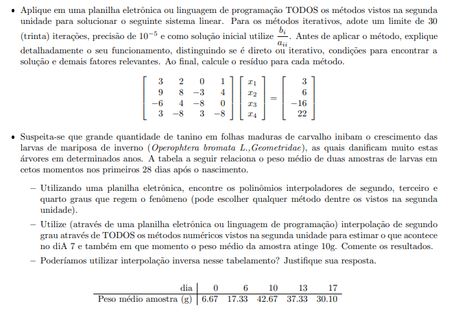

# Segundo_trabalho_calculo_numerico
 Trabalho referente à segunda unidade da disciplina de cálculo numérico - UFERSA
<h1></img> Link do vídeo explicativo: </h1>
https://www.youtube.com/watch?v=R4ZayBafvMU&ab_channel=VictorOliveira
 <h1>Questões de estudo: </h1>
</img>
